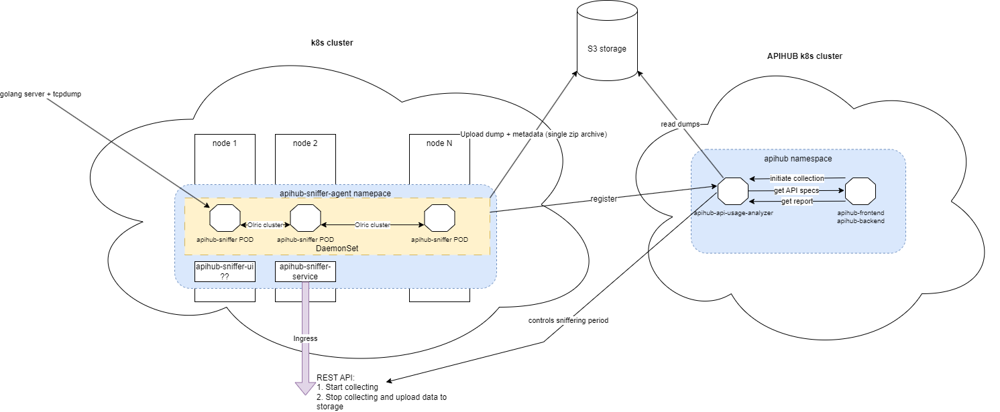

# qubership-apihub-traffic-analyzer

**Under development, alpha quality, not ready for usage**

A service to load, analyze and make reports on the captured packet data.
qubership-apihub-traffic-analyzer is intended to use as web-service in connection with [qubership-apihub-sniffer-agent](https://github.com/Netcracker/qubership-apihub-sniffer-agent).

## Arch diagramm

## High Level operation sequence

* Load and aggregate completed raw capture data from S3 storage (qubership-apihub-sniffer-agent is responisble for capturing raw data and uploading to S3)
* Delete raw capture data from S3 (optional step)
* Generate report or reports on capture data (this step incldues connection to Qubership-APIHUB for getting API details for k8s services)
* Receive (render) generated report data, store it in PostgreSQL.
* Clear aggregated report data

## Installation

Please refer to [Helm chart folder](./helm-templates/)

## Build

Just run build.cmd(sh) file from this repository
